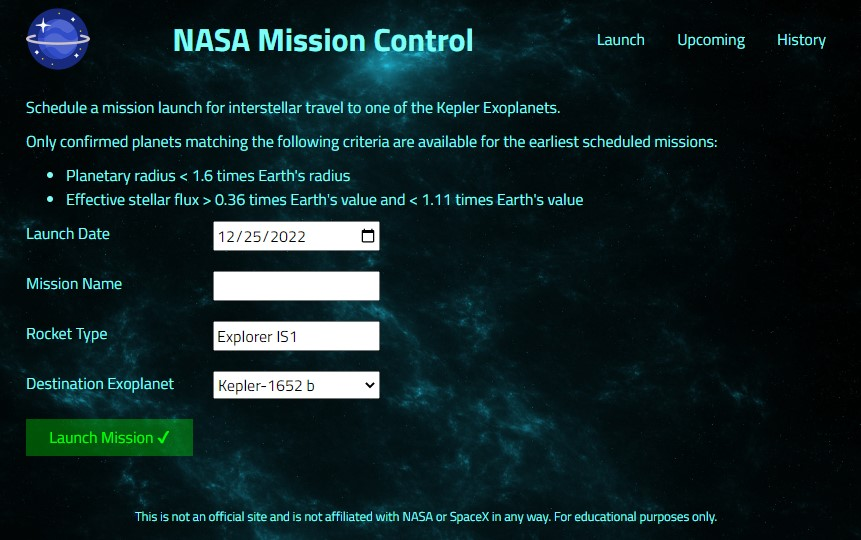

# Nasa Project

[ZTM](https://zerotomastery.io) project. The goal of this project was to create a full stack app that serves as a mission control dashboard. The frontend is getting data from an API that stores the different missions.

## Preview

## Project walkthrough

1. Create a mission by selecting a date, typing a mission name and rocket type and by selecting one of the 6 habitable exoplanets.
2. Navigate to the Upcoming page to display all schedule missions.
3. By clicking on the X in the Upcoming page a mission can be aborted.
4. Navigate to the History page to display all past missions, aborted and successful ones. 
